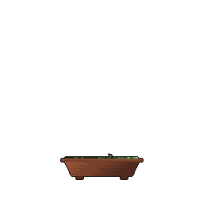

<!--
  egorthinks / egorthinks  —  GitHub profile README
  Centerpiece: git-bonsai GIF, grown daily by .github/workflows/bonsai.yml
-->

<h1 align="center">
  <a href="https://github.com/egorthinks">
    
  </a>
</h1>

<p align="center">
  <em>Founder&nbsp;·&nbsp;AI&nbsp;tooling&nbsp;·&nbsp;Notes&nbsp;&amp;&nbsp;tools&nbsp;for&nbsp;devs&nbsp;who&nbsp;want&nbsp;to&nbsp;stay&nbsp;sharp</em>
</p>

<!-- ── my git-bonsai — grows a little every day ───────────────────────────── -->
<p align="center">
  
</p>
<p align="center">
  <sub>🌿 A one-of-a-kind pixel-art bonsai, grown procedurally from my GitHub history · <a href="https://github.com/egorthinks/git-bonsai">git-bonsai</a></sub>
</p>

---

### 🧠 About

```yaml
name:      Egor Fedorov
role:      Founder
focus:     AI-native developer tooling
mission:   help devs who use AI every day stay sharp
writing:   https://egorthinks.com
currently: shipping open-source tools & notes
```

<!-- ── featured work ──────────────────────────────────────────────────────── -->
### 🚀 Featured work

| Project | What it is |
| :-- | :-- |
| **[MIND2IMAGE](https://github.com/egorthinks/MIND2IMAGE)** | 🧠 Translate EEG signals into images — neurotech × computer vision |
| **[RAG-system](https://github.com/egorthinks/RAG-system)** | 📚 Let LLMs answer from your own docs (retrieval-augmented generation) |
| **[CVITUM](https://github.com/egorthinks/CVITUM)** | 👁️ Computer vision made usable without a PhD |
| **[git-bonsai](https://github.com/egorthinks/git-bonsai)** | 🌿 The Action that grows the tree above ↑ |
| **[egorthinks.com](https://github.com/egorthinks/egorthinks.com)** | ✍️ My blog — notes for AI-native devs (Astro) |

<!-- ── stack ──────────────────────────────────────────────────────────────── -->
### 🛠️ Stack

<p>
  
  
  
  
  
  
</p>

<!-- ── stats ──────────────────────────────────────────────────────────────── -->
### 📊 By the numbers

<p align="center">
  
  
</p>

<!-- ── connect ────────────────────────────────────────────────────────────── -->
### 🤝 Connect

<p>
  <a href="https://egorthinks.com"></a>
  <a href="https://x.com/egorthinks"></a>
  <a href="https://www.linkedin.com/in/egorthinks"></a>
</p>

<p align="center">
  
</p>

<p align="center"><sub>🌿 the bonsai above grows a little every day — come back and watch it branch out</sub></p>
